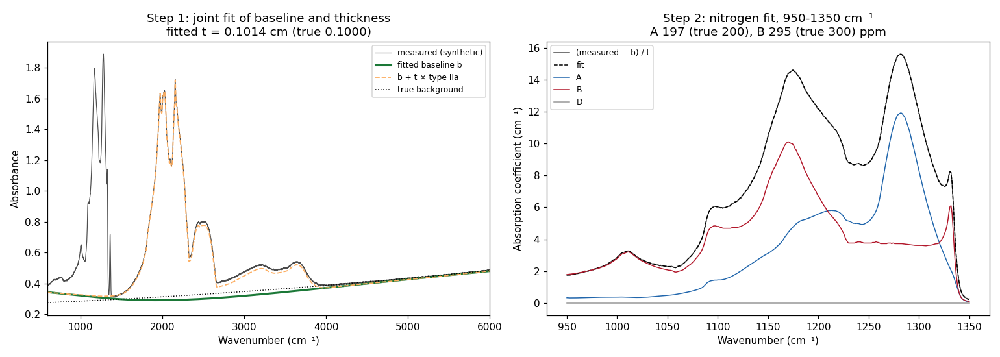
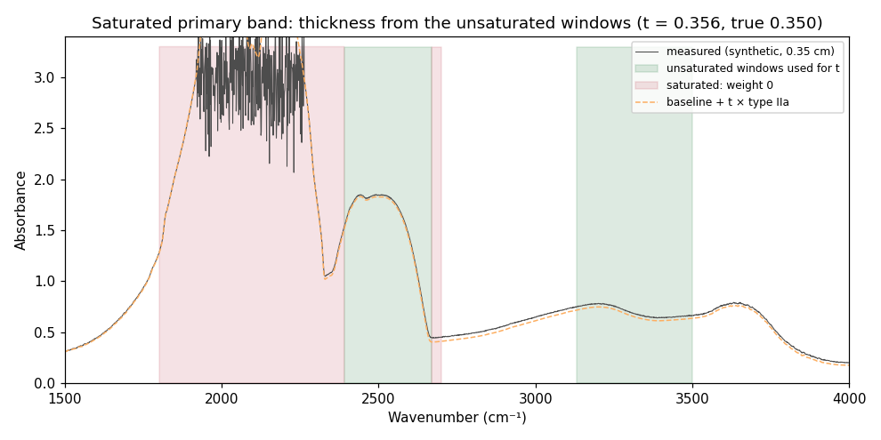
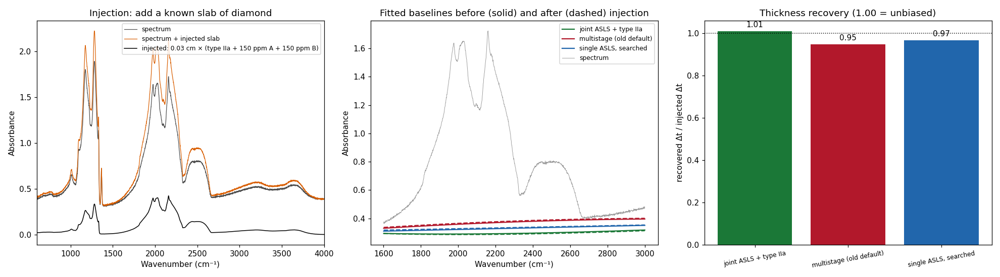
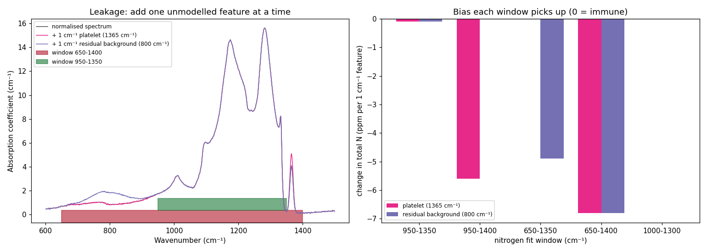
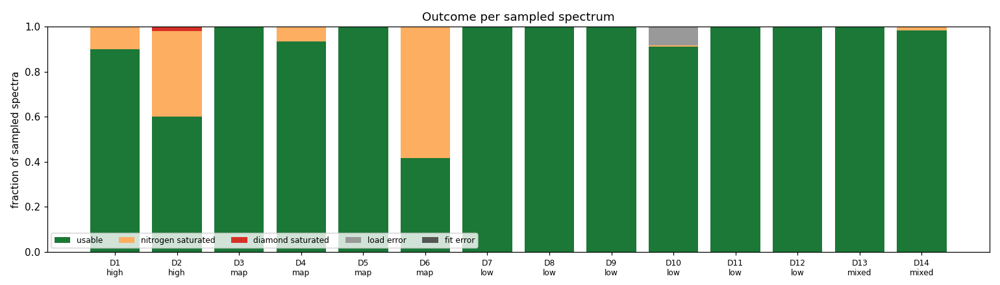
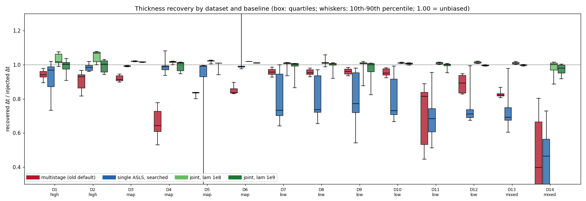
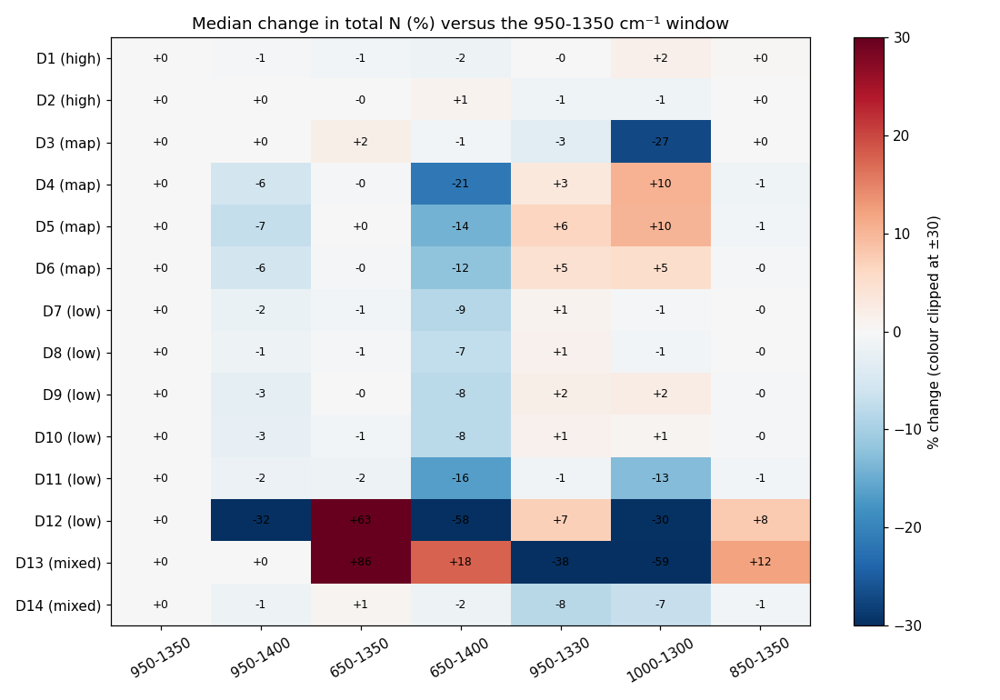
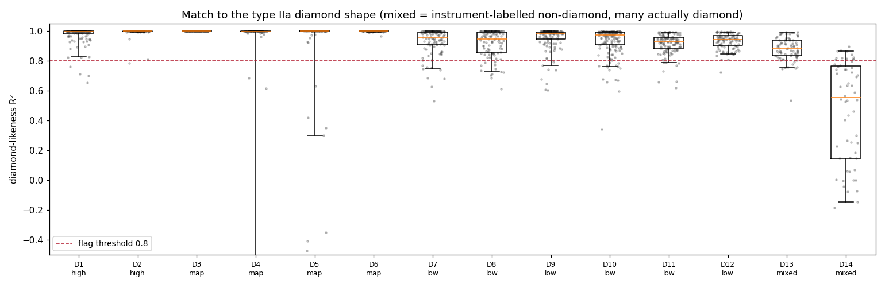
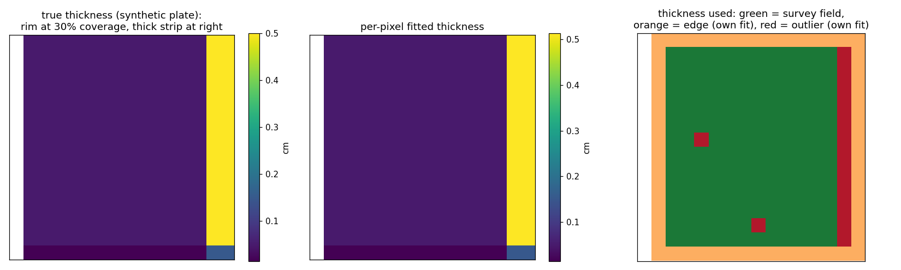

# Methods validation: baseline, thickness and nitrogen window

This page documents how the baseline, thickness and nitrogen-window methods were tested,
step by step, with figures. The decisions it supports are in
[design/baseline-and-window.md](design/baseline-and-window.md).

- **Method figures** (`method_*.png`) use synthetic spectra only: type IIa reference ×
  thickness, plus CAXBDY nitrogen components, plus a chosen background, peaks and noise.
  Every quantity is known. Regenerate with `uv run python scripts/make_method_figures.py`.
- **Study figures** (`study_*.png`) summarise the real-data study. No spectra are plotted;
  datasets appear only as D1-D14 with a quality group. Regenerate with
  `uv run python scripts/bias_study.py local_data/datasets.json --out local_data/bias_study_v2`, then
  `uv run python scripts/bias_study_figures.py local_data/bias_study_v2/results.jsonl`.
  The dataset list is local and git-ignored. No real data is in the repository.

## 1. The model being fitted

A transmission spectrum of a diamond is treated as

> measured absorbance = background + t × (type IIa absorption) + t × (nitrogen and other defects)

where t is the optical path (thickness, cm) and the type IIa spectrum is the intrinsic
absorption of 1 cm of nitrogen-free diamond
[CITATION NEEDED: origin of the type IIa reference spectrum]. After the background is
removed and the result divided by t, the one-phonon region (950-1350 cm⁻¹) is fitted with
the CAXBDY component spectra plus an offset and slope
[CITATION NEEDED: CAXBDY components; nitrogen fit window].

Every absolute concentration is divided by t, so **any error in t scales every ppm value by
the same factor**. B% is a ratio, so it does not depend on t.

## 2. The joint baseline (default from this change)

*Left:* the background b (green) and the thickness t are fitted **together**, as one
penalised least-squares problem:

> minimise Σ wᵢ (yᵢ − bᵢ − t·rᵢ)² + λ ‖D₂b‖²

Here r is the type IIa reference, D₂ the second-difference operator (so b is a smooth ASLS
curve), and w the ASLS asymmetric weights (p above the model, 1 − p below). The dashed line is
b + t × type IIa. *Right:* the normalised spectrum (measured − b)/t and its nitrogen
components. On this synthetic stone t is recovered to 1.4% and A and B to within 2%.

Why jointly: every other baseline is fitted first and the type IIa spectrum is scaled
afterwards. A smooth baseline fitted to the raw spectrum can rise into the broad two-phonon
band and remove part of it. The thickness then comes out low and the ppm values high. When
the band is part of the model, the baseline has no reason to absorb it. (An alternating
scheme, "fit t, subtract, fit ASLS, repeat", diverges and was rejected.)

Settings: λ = 1e9 on the 1 cm⁻¹ grid, p = 1e-3 (`joint_lam`, `joint_p`). The injection
study below found λ between 1e8 and 1e9 and p between 1e-3 and 1e-2 all within about 1-3%.
There is no search, and a spectrum takes about 25 ms.

### Saturated spectra

Thick stones saturate the primary two-phonon band (noisy plateau, red). Saturated points get
weight 0 and carry no information about t. The thickness comes from the unsaturated windows
(green): 2400-2670 and 3130-3500 cm⁻¹, as selected by the existing saturation test. Here
t = 0.356 cm against 0.350 true. Stones with every diamond window saturated are reported as
failures, not fitted.

## 3. Measuring bias on real spectra: injection

Real spectra have no known answer, so bias is measured by **adding a known signal to each
real spectrum and checking how much of it is recovered**. The spectrum's real background,
noise, resolution and extra peaks all stay in place.

*Left:* a slab Δt × (type IIa + 150 ppm A + 150 ppm B) is added (black curve; the orange
spectrum is the result). *Middle:* each method's fitted baseline before (solid) and after
(dashed) injection. *Right:* recovered Δt / injected Δt. An unbiased method gives 1.00.

This test measures **multiplicative** (thickness) bias: a method that removes a fixed
fraction of the diamond band recovers the same fraction of the injected slab. Nitrogen
recovery is exact for every method once thickness is accounted for, because the nitrogen fit is
linear. The injected slab is 30% of each spectrum's own fitted thickness; spectra where the
injection changed which diamond windows are unsaturated were excluded.

## 4. Measuring window bias: leakage

A linear fit recovers an injected nitrogen increment exactly, whatever the window, so the
injection test cannot judge the window. Window bias is **additive**: features the model does
not contain end up counted as A or B. It is measured by adding one unmodelled feature at a
time and recording the change in total N per 1 cm⁻¹ of feature.

*Left:* a 1 cm⁻¹ platelet peak at 1365 cm⁻¹ (pink) and a 1 cm⁻¹ residual background bump at
800 cm⁻¹ (purple), with the 950-1350 and 650-1400 windows marked. *Right:* change in total N
for each window. 950-1350 is immune to both. Windows ending at 1400 are pulled down by the
platelet, and windows starting at 650 by residual background. On real spectra the measured
platelet size predicts the observed 1400-vs-1350 difference (correlation 0.8).

## 5. The real-data study

1,360 spectra were sampled at random from 14 datasets of very different quality: high-quality
stones, thin-plate maps, lower-quality stone collections and melee. Two melee sets are
labelled "non-diamond" by the instrument, but many of those are diamonds (the *mixed* group).

*Usable* means the nitrogen band and at least one diamond window are unsaturated (1,272
spectra). Nitrogen saturation is common in the high-quality stones and in one map.

### Thickness bias by baseline

| baseline | median error | p90 error | spectra within 5% |
|---|---|---|---|
| multistage (previous default) | 8.6% | 35.5% | 23% |
| single ASLS, searched | 26.3% | 49.6% | 33% |
| joint, λ 1e8 | 1.4% | 4.8% | 90% |
| **joint, λ 1e9 (default)** | **0.9%** | **4.9%** | **90%** |

(1,109 spectra with a valid injection.)

- **Multistage:** 5-16% low on stones and maps (36% on one thin plate). Its stretched rubber
  band removes part of the two-phonon band.
- **Searched single ASLS:** close to unbiased on clean spectra, but 25-30% low on noisier
  stones and melee. Its search objective compares only the *shape* of the band (it divides out
  the amplitude), so a baseline that removes a fixed fraction of the band is not penalised, and
  the search drives p to its upper limit in 43-90% of spectra.
- **Joint:** median 0.98-1.02 on every dataset, including the mixed melee sets.
  λ = 1e8 over-recovers slightly on clean stones (up to 1.07), so 1e9 is the default.

On two hand-tuned maps (interior pixels), the joint fit reproduced the hand-tuned nitrogen
absorbance maps (N × t; correlation 0.989 and 0.994). Its thickness maps were closer to the
hand-tuned ones and smoother than the searched single ASLS's. So it keeps the real zoning.
A polynomial-background version of the same idea did not: it scored well on injection but
flattened the zoning, and was rejected.

### Window bias by dataset

Median change in total N relative to 950-1350 cm⁻¹. Ending at 1400 lowers N by 1-3% on
stones and 6-7% on platelet-rich maps. 650-1400, the window of the older map scripts,
lowers it by 7-21%. Ending before 1350 removes the sharp structure near 1332 cm⁻¹ and raises
N. The two lowest-signal melee sets (D12, D13) swing by tens of percent under any window
change, so their nitrogen values should be treated as semi-quantitative. The noise-driven
spread of N was 0.02-0.5% everywhere: bias from the window, not noise, is what matters.
(Window results use the searched single ASLS normalisation, as in the first version of the
study.)

### Diamond-likeness

R² of the normalised spectrum against the type IIa shape over the unsaturated windows.
Diamond datasets sit mostly above 0.8. In D14, instrument-labelled non-diamond, 80% fall
below 0.8. In D13, also labelled non-diamond, only 10% do, consistent with most of D13 being
misclassified diamonds. Results now carry `diamond_r2` and a `QA` warning below 0.8
(`min_diamond_r2`); spectra are flagged, never removed.

## 6. Maps: survey thickness, edges and outliers

A synthetic plate: uniform thickness, a partly covered rim (30% coverage), a thick strip on
the right, and one off-sample column. With `thickness_mode="survey"`:

1. Interior pixels on a coarse grid are fitted.
2. A robust thickness field is fitted, rejecting outliers beyond `outlier_mad` robust standard
   deviations.
3. Each pixel uses the field (green) unless it lies within `edge_width_px` of the edge or map
   border (orange) or is far from the field (red). Those pixels keep their own fitted thickness.

On a real thin plate, pixels one to three steps from the edge fit 0.3-1.2 decades thinner:
the aperture only partly covers the sample, and nitrogen drops by the same fraction, so
their own fit is the right normalisation.

## 7. Limits of this validation

- Injection measures bias relative to each spectrum's own model. A systematic error in the
  type IIa reference or the CAXBDY components would not show up
  [CITATION NEEDED: provenance and uncertainty of the reference spectra].
- Real spectra with independently known nitrogen (for example from combustion analysis or
  certified reference stones) are still needed to confirm absolute ppm.
- Hand-tuned maps are a reference, not ground truth.
- Window results come from the study's first version; rerun with the joint normalisation
  once more melee data is added.
